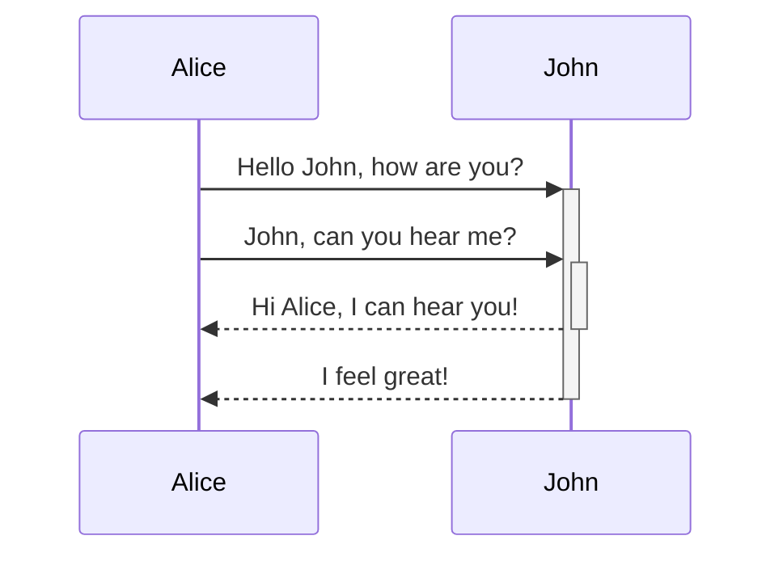
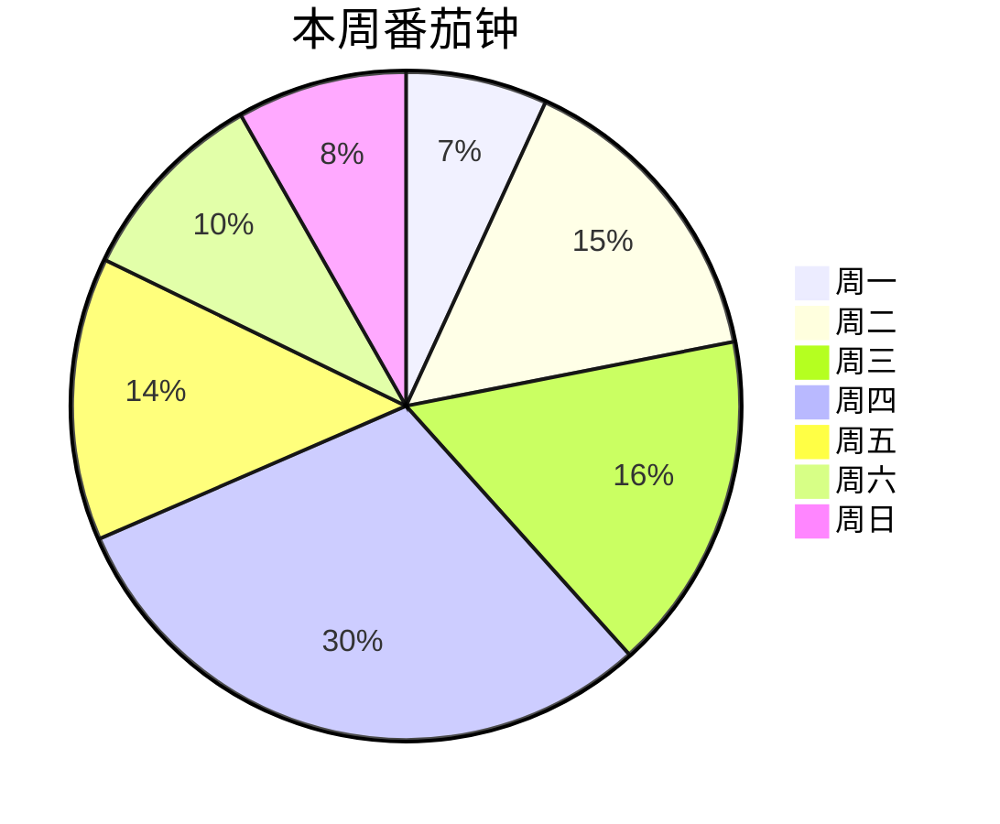

http://jdev.tw/blog/7066
## 1. Markdown是什么？

1. Markdown是一个轻量级的标记语言，相较于复杂、繁多的HTML，Markdown更简单、更容易使用
2. 将纯文字内容赋予格式化的标记，能让文字转换成HTML
3. Markdown提供了易读易写的标记格式
4. [[John Gruber]]在2004年发明
5. 随着科技的进步，Markdown也衍生了多个版本

## 2. 为什么要学Markdown?

- Markdown应用范围广泛：举凡网站、简报、笔记、文件、书籍、电子邮件、即时通讯软体都在使用。
- Markdown可携性高
- Markdown具有平台独立性

#### 2.1. 几个Markdown的应用

太多了，族繁不及备载，列举一二。

- 线上Markdown编辑器：[StackEdit](https://stackedit.io/)、[HackMD](https://hackmd.io/)
- 静态网站产生器(Static Site Generator)：[Hugo](https://github.com/gohugoio/hugo)、[MkDocs](https://www.mkdocs.org/)、[VuePress](https://vuepress.vuejs.org/)
- 浏览器扩充：
    - Email格式转换：[Markdown Here](https://markdown-here.com/)
    - 网站下载成Markdown：[MarkDownload](https://chrome.google.com/webstore/detail/markdownload-markdown-web/pcmpcfapbekmbjjkdalcgopdkipoggdi)
- Windows Markdown编辑器：[Markdown Monster](https://markdownmonster.west-wind.com/)、[ghostwriter](https://wereturtle.github.io/ghostwriter/)
- macOS Markdown编辑器：[iA Writer](https://ia.net/zh-hant/writer)、[MacDown](https://macdown.uranusjr.com/)、[Bear](https://bear.app/)、[Craft](https://www.craft.do/)、[Drafts](https://getdrafts.com/)
- Linux Markdown编辑器：[ghostwriter](https://wereturtle.github.io/ghostwriter/)、[ReText](https://github.com/retext-project/retext)
- 跨平台 Markdown编辑器：[Typora](https://typora.io/)
- iOS / Android Markdown编辑器：[iA Writer](https://ia.net/zh-hant/writer)、[Drafts](https://getdrafts.com/)

## 3. Markdown的处理步骤

![[Markdown Processing|700]]


## 4. 涵盖的标记

#### 4.1. 区块标记


#### 4.2. 行内标记


## 5. 标题 (Heading)

|Heading|HTML|
|:--|:--|
|# Heading Level 1|`<h1>Heading Level 1</h1>`|
|## Heading Level 2|`<h2>Heading Level 2</h2>`|
|#### Heading Level 3|`<h3>Heading Level 3</h3>`|
|##### Heading Level 4|`<h4>Heading Level 4</h4>`|
|###### Heading Level 5|`<h5>Heading Level 5</h5>`|
|####### Heading Level 6|`<h6>Heading Level 6</h6>`|

> [!TIP] 技巧💡  
> 1. 井号后至少加一个空白  
> 2. 井号紧接标题会变成标签  
> 3. 记忆方法：带头大哥、二哥、三哥... 六弟，井号越多的等级越小
> 
> ##### 我的用法
> 
> 1. # : 档名(笔记名称)
> 2. ## : 大标题(章)
> 3. ###：次级标题(节)
> 
> [!OBS]  
> 井号后紧接英数字会形成标签：`#標籤`

#### 5.1. 另类标题

|Heading|HTML|
|:--|:--|
|Heading Level 1  <br>=============|`<h1>Heading Level 1</h1>`|
|Heading Level 2  <br>---------------|`<h2>Heading Level 2</h2>`|

#### 5.2. 段落 (Paragraph)

段落间以一个空行隔开。

> [!INFO]+ 资讯  
> Obsidian设定→【编辑器】→【精确的换行符号】：勾选后设定成Markdown的严格换行  
> * 连续两行间插入一行，才会变成两行，否则会连接在一起  
> * 第一行最末插入两个空白会变成两行
> 
> [!comment] 对于段落的建议  
> 1. 不要勾选【精确的换行符号】  
> 2. 段落开头不要加空白

## 6. 换行 (Line break)

【精确的换行符号】设定会影响换行的行为。

> [!comment]+ 对于换行的建议  
> 1. 不要勾选【精确的换行符号】  
> 2. 不要用行末两个空白的方法换行  
> 3. 特殊情况下用HTML的 <br> 插入换行(例如在表格的储存格里要换行)

## 7. 文字变化 (Emphasis)

#### 7.1. 斜体

被前后一个星号(*)、一个底线(_)或 $ (非Markdown)：夹住的文字会变成斜体。

|Italic text|HTML||
|:--|:--|---|
|`話說天下大勢，*分久必合*`|`話說天下大勢，<em>分久必合</em>`|话说天下大势，_分久必合_|
|`，_合久必分_`|`，<em>合久必分</em>`|，_合久必分_|
|`$數學符號使用$`|`<mjx-math class="MJX-TEX" aria-hidden="true">...`|$数学符号使用$`|

> [!comment] 对于斜体的建议  
> 尽量使用 *

#### 7.2. 粗体

被前后两个星号(**)或两个底线(__)夹住的文字会变成粗体。

|Bold text|HTML|显示|
|:--|:--|---|
|`話說天下大勢，**分久必合**`|`話說天下大勢，<strong>分久必合</strong>`|话说天下大势，**分久必合**|
|`，__合久必分__`|`，<strong>合久必分</strong>`|，**合久必分**|

> [!comment] 对于粗体的建议  
> 尽量使用**

#### 7.3. 粗斜体

被前后三个星号(**_)或三个底线(_**)夹住的文字会变成斜体。**_ 两个底线一个星号或_**两个星号一个减号等的组合也可以用，不过不建议使用。

|Italic text|HTML||
|:--|:--|---|
|`話說天下大勢，***分久必合***`|`話說天下大勢，<strog><em>分久必合</em></strog>`|话说天下大势，**_分久必合_**|
|`，___合久必分___`|`，<strong><em>合久必分</em></strong>`|，**_合久必分_**|

> [!comment] 对于斜体的建议  
> 尽量使用 ***

#### 7.4. 删除文字

被前后两个波浪号(～～)夹住的文字会变成删除样式。

> [!EXAMPLE] 范例  
> 被前后两个波浪号(~~)夹住的文字会变成~~删除样式~~。

#### 7.5. 高亮文字

被前后两个等号(==)夹住的文字会变成重要强调样式。

> [!EXAMPLE] 范例  
> 学习Obsidian的最好方法是==开始写==、 ==认真写==，主题和外挂只是辅助。
> 
> [!WARNING] 注意❗  
> Dataview的行内表示式使用「`= 运算式 `」 的格式，倒引号再两个等号会造成Dataview解析错误，因此使用 = 。

#### 7.6. 下底线

非Markdown：Markdown没有底线格式，可以使用HTML的<u>与</u>来形成文字底线。

> [!EXAMPLE] 范例  
> 不要在Obsidian的外挂上花太多精力，笔记本身才是最重要的。

#### 7.7. 上顶线

非Markdown：使用HTML的 ruby 等标签。

> [!EXAMPLE] 范例  
> 汉字ㄏㄢˋ ㄗˋ
> 
> 计算机dian nao  
> 重要内容！ 重要内容！

#### 7.8. 上标字与下标字

非Markdown：Obsidian没有直接支援上标字与下标字的语法，有两个方法解决。

##### 7.8.1. 方法1. MathJax

用[MathJax](http://docs.mathjax.org/en/latest/basic/mathjax.html)(JavaScript display engine for LaTeX, MathML, and AsciiMath notation)语法达成。

> [!TIP] 语法  
> $文字^上标字$  
> $文字_下标字$
> 
> [!WARNING] 注意  
> 会变成斜体

- $E=MC^2$
- $CO_2$

##### 7.8.2. 方法2. 用HTML标签

> [!TIP] 语法  
> 文字<sup>上标字</sup>  
> 文字<sub>下标字</sub>

- E=MC2
- CO2

#### 7.9. 行内程式码

行内程式码(用一个倒引号夹住文字)也可以变化文字的显示，有需要时也可使用。

## 8. 区块引言 (Blockquotes)

1. 以「> 」(小于再加一个空白)在每行开头以形成区块引言。
2. 以「>> 」(两个小于再加一个空白)在每行开头以形成第二阶层的区块引言。
3. 区块里能再使用部份Markdown标记，具体能使用的标记因应用系统的实作而有不同。

> 111
> 
> > 222 **粗体**
> > 
> > > AAA _斜体_  
> > > BBB **_粗斜体_**  
> > > 333  
> > > 444
> 
> [!comment] 对于区块引言的建议  
> 1. 区块前后最好插入一行空行  
> 2. 可以用Obsidian的Callouts扩充取代
> 
> [!OBS]
> 
> #### Callouts重点提示语法
> 
> > [!Type] Title  
> > 内容`

## 9. 列表 (Lists)

#### 9.1. 有序列表

1. 以「数字. 」(数字、点、空白)或「数字) 」开头
2. 数字不必照顺序排列
3. 起始数字以列表第一个项目的数字开始递增
4. 列表项目间有空行时，每个项目会自动插入空行。空行后有非列表内容时，第二个区块会以开始项目的数字重新编号
5. 自动重新编号：按Tab再按Shift+Tab
6. 开头四个空白或Tab形成第二阶层列表

> [!comment] 对于有序列表的建议  
> 尽量使用 数字. 格式

#### 9.2. 无序列表

1. 以「星号 」(*、空白)、「减号 」或「加号 」开头
2. 列表项目间有空行时，每个项目会自动插入空行
3. 开头四个空白或Tab形成第二阶层列表
4. 项目里有「数字. 」(数字、点、空白)造成显示异常，可以在点的左侧加上跳脱字元反斜线

> [!comment] 对于无序列表的建议  
> 固定使用同一种符号，尽量使用 *

## 10. 程式码 (Code)

#### 10.1. 行内程式码

1. 用一个倒引号夹住程式码
2. 用两个倒引号以显示行内程式码

#### 10.2. 程式码区块

1. 用三个倒引号开头，结尾行用三个倒引号开头
2. 三个倒引号也可用波浪号（~~~）
3. 程式码每行用至少四个空白或Tab开头

> [!TIP] 技巧💡  
> 要显示程式码区块完整内容：最外面用4个倒引号夹住

#### 10.3. 扩充语法

开头倒引号后可指定程式码使用语言。

```html
<kbd>Ctrl+Enter</kbd>
```

## 11. 水平分隔线

三个以上的星号、减号或底线。

---

> [!comment] 对于水平分隔线的建议  
> 分隔线上下最好用插入一个空行

## 12. 网址链接

提示文字可省略。

> [!TIP] 语法  
> [显示文字](http://jdev.tw/blog/%E7%B6%B2%E5%9D%80%E9%8F%88%E6%8E%A5 "提示文字")  
> <网址链接>  
> <Email@your_Email_Address>
> 
> ---
> 
> [显示文字][引用代码]
> 
> [引用代码]: 网址链接
> 
> [!INFO] 💡 小技巧 如何记忆？  
> 成语「内方外圆」→「前方后圆」
> 
> [!comment] 对于链接的建议  
> 网址里如果有空白时：  
> 1. 把空白改成「%20」  
> 2. 网址改成<链接网址>  
> 3. Obsidian在还到http://、https://开头的网址文字时，会自动变成网址超链接
> 
> [!OBS] Obsidian内部链接  
> [[本地笔记路径]]  
> [[本地笔记路径|特定的显示文字]]  
> [[本地笔记路径#标题]]  
> [[本地笔记路径^区块代码]]

## 13. 图片

> [!TIP] 语法
> 
>    
>    
>    
>    ![显示文字][引用代码]
> 
> [引用代码]: 网址链接
> 
> [!obs]  
> ![[本地图片路径]]  
> ![[本地图片路径|显示宽度]]  
> ![[本地图片路径|显示宽度x高度]]
> 
> ##### 嵌入内部链接
> 
> ![[内部链接]]  
> ![[内部链接|特定显示文字]]  
> ![[内部链接#标题]]  
> ![[内部链接^区块代码]]

[](http://jdev.tw/)

## 14. 表格

#### 14.1. 有对齐功能的表格

|标题1|标题2|标题3|
|:--|:-:|--:|
|111|222|333|
|444|555|666|

#### 14.2. 简单表格

```
標題1 | 標題2 | 標題3
--|--|--
111 | 222 | 333
444 | 555 | 666
```

> [!TIP] 技巧  
> 储存格里的换行：用 br  
> 储存格里有用到Pipe(|)时：|

## 15. 区块代码

段落下方插入境^区块代码让内部链接参考使用。

## 16. 注脚

1. [^数字或注脚代码]：指定注脚，自动以数字显示
2. [^数字或注解代码]: 说明文字`：注脚说明

Markdown标记语言[1](http://jdev.tw/blog/7066#fn-7066:%E8%AA%9E%E8%A8%80)由 John Grube发明。

## 17. 任务

输入任务描述后按一个 Ctrl+Enter即可快速形成任务语法。开头字元可用减号、加号与星号。

> [!TIP] 语法  
> - [ ] 未完成任务描述  
> - [x] 已完成任务描述

## 18. 注解

不显示在HTML里的内容即为注解。

> [!TIP] 语法  
> 以<!--开头，-->结尾  
> 以 %% 夹位的内容即为不显示的注解

## 19. 嵌入网页

<iframe src="网址"></iframe>

## 20. 第三方整合

#### 20.1. Mermaid: 流程图等

核心支援。

- [Online FlowChart & Diagrams Editor - Mermaid Live Editor](https://mermaid-js.github.io/mermaid-live-editor/edit#pako:eNpVkE1qw0AMha8itEohvoAXhcZOsgmk0Ow8WQiPnBmS-WEsU4Ltu3ccU2i1kt77nhAasQ2ascRbomjgUisPuT6ayiTbi6P-CkXxPh1ZwAXPzwl2m2OA3oQYrb-9rfxugaAaTwvGIMb6-7xa1St_9jxB3ZwoSojXv87lO0ywb-ynyev_OyZxTh2ajsqOipYSVJReCG7RcXJkdT59XBSFYtixwjK3mjsaHqJQ-TmjQ9QkvNdWQsJS0sBbpEHC19O3v_PK1JbyI9wqzj8k-lxH)







#### 20.2. Excalidraw

#### 20.3. Diagrams

#### 20.4. Emoji

## 21. YAML Front matter

预设关键字：

#### 21.1. tags

- 不能用空白
- 可以用底线(_)或减号(-)当做分隔字元
- 不能全为数字：#3c 可以用，但 #2022 无法使用
- 能用正斜线(/)形成巢状式标签：3c/notebook

> [!TIP] 技巧💡  
> tags写法很有弹性，以下皆可使用：
> 
> ```
> tags: test1, test2, tet3/test3-1
> tags: [ test1, test2, tet3/test3-1 ]
> tags: 
>   - test1 test2 tet3/test3-1 
>  
> tags: 
>   - test1
>   - test2
>   - tet3/test3-1 
> ```

#### 21.2. aliases

笔记档名的别名，让一篇笔记有多个名称。

```
---
aliases: [Markdown用法, Markdown語法彙總]
---
```

#### 21.3. cssClasses

cssClass或cssClasses皆可使用。让本篇笔记套用特定的CSS类别。

#### 21.4. publish

publish: true 发布到Publish网站，publish: false 不发布到Publish网站。

## 22. 相关链接

- [Markdown 语法说明](https://markdown.tw/)
- [教程-MarkDown](http://markdown.cn/)
- [Format your notes - Obsidian Help](https://help.obsidian.md/How+to/Format+your+notes)
- ✅ 影片里使用的Markdown文件: